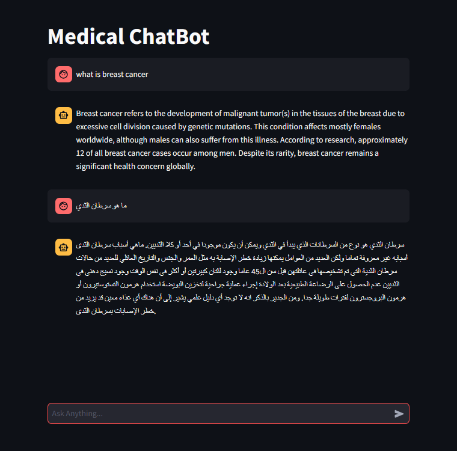

# 🧠 Medical-Chatbot-using-Retrieval-Augmented-Generation-RAG-

This is a chatbot that answers medical questions using PDFs and a language model.  
It retrieves relevant content using FAISS and generates answers using LLaMA 3.1.

---

## 💡 Project Overview

- Users can ask questions in Arabic or English.
- The system loads medical PDFs, splits the content into chunks, and generates vector embeddings.
- Using **FAISS**, it retrieves the most relevant parts of the text.
- The context is sent to **LLaMA 3.1-8B Instruct** via Hugging Face to generate a detailed answer.

---

## 🧰 Technologies Used

- `Streamlit` – Web interface  
- `FAISS` – Vector similarity search  
- `LangChain` – Text splitting & document handling  
- `SentenceTransformers` – Embedding generation  
- `Transformers` (LLaMA 3.1) – Answer generation  
- `BitsandBytes` – Efficient model loading (4-bit)  
- `PyPDFLoader` – PDF reading  

---

## 🚀 Installation

1. Install dependencies:

```bash
pip install streamlit langchain langchain-community
pip install sentence-transformers chromadb
pip install transformers torch torchvision torchaudio
pip install huggingface_hub pypdf bitsandbytes faiss-cpu
```

---

## ▶️ Running the App

To run the application:

```bash
streamlit run app.py
```

If you're using **Kaggle or Colab**:

```bash
!streamlit run /kaggle/working/app.py & npx localtunnel --port 8501
```

---

## 💬 Example

**User:** what is breast cancer  
**Bot:** Breast cancer refers to the development of malignant tumor(s) in the tissues of the breast due to excessive cell division caused by genetic mutations. This condition affects mostly females worldwide, although males can also suffer from this illness. According to research, approximately 12% of all breast cancer cases occur among men. Despite its rarity, breast cancer remains a significant health concern globally.

**User:** ما هو سرطان الثدي  
**Bot:** سرطان الثدي هو نوع من السرطانات التي تبدأ في الثدي ويمكن أن يكون موجودًا في أحد أو كلا الثديين. على الرغم من أن سرطان الثدي يُصاب به غالبًا النساء، إلا أن الرجال يمكنهم أيضًا الإصابة به، وإن كانت النسبة أقل بكثير. العوامل التي تزيد من خطر الإصابة بسرطان الثدي تشمل التاريخ العائلي، الطفرات الجينية، والعمر، من بين عوامل أخرى. تشمل الأعراض وجود كتلة في الثدي، تغير في شكل الحلمة، أو إفرازات غير طبيعية.

---

## 🖼️ Screenshot


